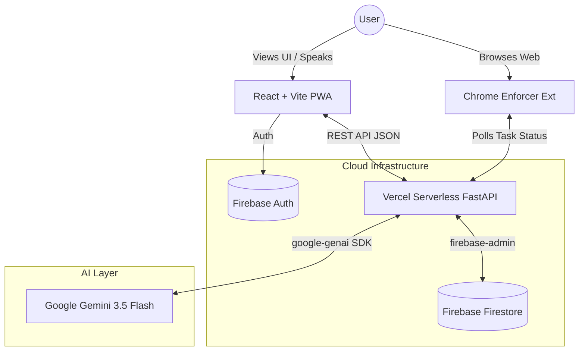

# Trackly AI

Live URL: https://trackly-eosin.vercel.app/

Trackly AI is a ruthless, autonomous productivity application designed for extreme procrastinators. 

It acts as an aggressive accountability partner powered entirely by **Google's Gemini 3.5 Flash** model, utilizing its lightning-fast multimodal reasoning capabilities to act as a task planner, an image-verifying habit judge, and a ruthless accountability coach.

## The Problem
Traditional to-do lists are passive. They let you write down tasks and then happily sit back while you completely ignore them. When you miss a deadline, nothing happens. The system enables your procrastination instead of fighting it.

## The Solution
Trackly takes a hostile approach to productivity. When you set a task, you assign a deadline and a list of distraction websites (like `youtube.com`). If you miss that deadline, the system goes into **Nuclear Lockdown**:
1. Your dashboard is hijacked.
2. The **AI Coach** interrogates you on why you failed.
3. A custom **Chrome Extension** blocks your assigned distraction websites.
4. The lockdown *only* ends when you successfully negotiate a new deadline with the AI.

---

## Features (The 5 Phases of Expansion)

### Phase 1: Core AI & Brutalist UI
- **Brutalist Glassmorphism UI:** Built with raw CSS variables and native React (no Tailwind/MUI).
- **AI Task Onboarding:** Define a high-level goal, and Gemini breaks it down into actionable tasks.
- **Visual Habit Verification:** Upload a photo to prove you completed a habit. Gemini's multimodal vision analyzes the image to verify it.

### Phase 2: Production Rigor
- **FastAPI on Vercel Serverless:** Python backend running serverlessly on Vercel.
- **Strict Pydantic Validation & Auto-Retries:** Wraps Gemini JSON responses in a validation layer. If the AI hallucinates bad JSON, the system intercepts it and automatically retries with a stricter prompt.
- **Sentry & Structured Logging:** Full observability for API errors, token usage, and latency.

### Phase 3: AI Evaluation Layer
- **Prediction Logging & Outcome Tracking:** Every risk prediction made by the AI is logged to Firestore. When a task is marked complete or failed, the actual outcome is recorded.
- **Admin Dashboard:** A real-time UI mapping the AI's predictions vs. reality to measure model accuracy over time.

### Phase 4: High-Weight Social Features
- **Accountability Squads:** Create and join accountability groups.
- **Dynamic Leaderboards:** Compete against friends. Earn 10 points for every task completed successfully.
- **AI Voice Mode:** The AI Coach literally speaks back to you using the Web Speech API.
- **Progressive Web App (PWA):** Fully installable mobile companion app.
- **Weekly Retrospective Engine:** A cron-triggered AI pipeline that summarizes your weekly completed tasks into an encouraging, aggressive email.

---

## System Architecture



## Tech Stack
* **Backend:** Python, FastAPI, Pydantic, Sentry, `google-genai`, Vercel Serverless.
* **Frontend:** React, Vite, TypeScript, Firebase Client SDK, Web Speech API.
* **Database:** Firebase Firestore, Firebase Auth.
* **CI/CD:** GitHub Actions (Ruff, Pytest, Vitest, ESLint, TypeScript).

## Local Development Setup

### 1. Clone & Install
```bash
git clone https://github.com/samashech/samashechcal.git
cd samashechcal

# Frontend
cd frontend
npm install

# Backend
cd ../
python3 -m venv venv
source venv/bin/activate
pip install -r requirements.txt
```

### 2. Environment Variables
Create a `.env` file in the root directory:
```env
GEMINI_API_KEY=your_gemini_api_key
FIREBASE_SERVICE_ACCOUNT={"your_firebase_admin_json_string": "..."}
```

### 3. Run Servers
```bash
# Terminal 1: Backend
uvicorn backend.main:app --reload

# Terminal 2: Frontend
cd frontend
npm run dev
```

## Case Study: Engineering Resilient AI
Building autonomous AI agents requires defensive programming. LLMs are non-deterministic, meaning they will eventually output malformed data, no matter how good the prompt is. 

**How we solved AI hallucinations in Trackly:**
Instead of hoping Gemini returns perfect JSON 100% of the time, we built a `call_gemini_structured` interceptor. It:
1. Feeds the `Pydantic` schema definition into the prompt.
2. Intercepts the response and attempts a strict `Pydantic.parse_raw()`.
3. If it throws a `ValidationError`, the wrapper *automatically* generates a secondary prompt containing the exact error and the broken JSON, telling the model to fix its mistake.
4. If it fails a second time, it safely degrades to a hardcoded fallback dictionary to ensure the UI never crashes.

This single layer took the application from a "cool prototype" to a resilient, production-ready system.
